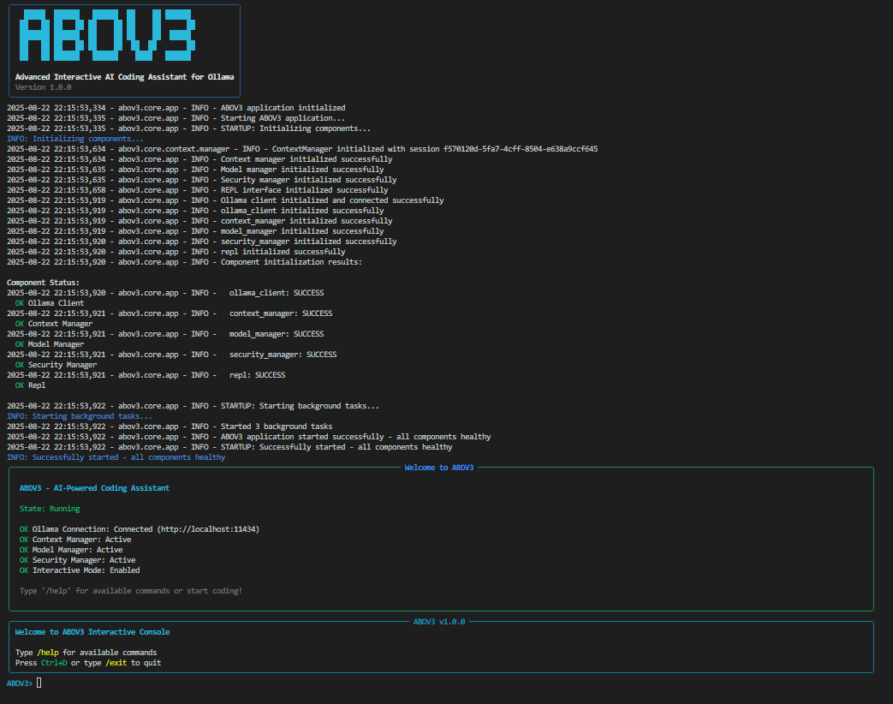

# ABOV3 4 Ollama

**Advanced Interactive AI Coding Assistant for Ollama**

[](https://github.com/abov3/abov3-ollama)
[](https://python.org)
[](LICENSE)
[](https://ollama.ai)

ABOV3 4 Ollama is a powerful Python-based console application that provides an interactive CLI interface for AI-powered code generation, debugging, and refactoring using local Ollama models. Built for developers who want enterprise-grade AI assistance without cloud dependencies.



## Features

### Core Capabilities
- **Interactive Chat Interface**: Rich terminal-based chat with syntax highlighting
- **Code Generation**: Generate code in any programming language
- **Code Analysis & Debugging**: Analyze existing code and identify issues
- **Refactoring Assistance**: Intelligent code refactoring suggestions
- **Multi-Model Support**: Work with any Ollama-compatible model
- **Conversation History**: Persistent chat history with search capabilities
- **Export Functionality**: Export conversations and code to various formats

### Advanced Features
- **Context Management**: Intelligent context handling for long conversations
- **Plugin System**: Extensible architecture with built-in and custom plugins
- **Model Fine-tuning**: Fine-tune models for specific coding tasks
- **Security & Privacy**: Enterprise-grade security with local processing
- **Performance Monitoring**: Built-in performance metrics and optimization
- **Git Integration**: Seamless integration with Git workflows
- **Multi-platform Support**: Works on Windows, macOS, and Linux

### Developer Experience
- **Rich Terminal UI**: Beautiful, responsive terminal interface
- **Auto-completion**: Intelligent command and code completion
- **Custom Keybindings**: Customizable keyboard shortcuts
- **Configuration Management**: Flexible configuration system
- **Comprehensive Testing**: Full test suite with CI/CD integration
- **Documentation**: Extensive documentation and examples

## Quick Start

### Prerequisites
- Python 3.8 or higher
- [Ollama](https://ollama.ai) installed and running
- At least one language model pulled in Ollama

### Installation

```bash
# Clone the repository
git clone https://github.com/abov3/abov3-ollama.git
cd abov3-ollama

# Install dependencies
pip install -r requirements.txt

# Install ABOV3
pip install -e .
```

### First Run

```bash
# Start ABOV3 (will run setup wizard on first launch)
abov3

# Or start directly with chat
abov3 chat
```

### Basic Usage

```bash
# Interactive chat session
abov3 chat

# Use specific model
abov3 chat -m llama3.2:latest

# Set temperature
abov3 chat -t 0.9

# Continue last conversation
abov3 chat --continue-last

# List available models
abov3 models list

# Install a new model
abov3 models install codellama:latest

# View configuration
abov3 config show

# Search conversation history
abov3 history search "python function"
```

## Architecture Overview

ABOV3 follows a modular, plugin-based architecture designed for scalability and maintainability:

```
abov3/
├── core/                   # Core application logic
│   ├── app.py             # Main application class
│   ├── config.py          # Configuration management
│   ├── api/               # API clients and communication
│   └── context/           # Context and memory management
├── models/                # Model management and fine-tuning
├── ui/                    # User interface components
│   ├── console/           # Terminal-based UI
│   └── components/        # Reusable UI components
├── plugins/               # Plugin system
│   ├── base/              # Plugin framework
│   └── builtin/           # Built-in plugins
├── utils/                 # Utility modules
└── tests/                 # Test suite
```

## Configuration

ABOV3 uses a hierarchical configuration system with support for:
- TOML configuration files
- Environment variables
- Command-line overrides
- Interactive configuration

Example configuration:

```toml
[model]
default_model = "llama3.2:latest"
temperature = 0.7
max_tokens = 4096

[ollama]
host = "http://localhost:11434"
timeout = 120

[ui]
theme = "dark"
show_timestamps = true
syntax_highlighting = true

[security]
enable_content_filter = true
sandbox_mode = false
```

## Plugin Development

ABOV3 features an extensible plugin system. Create custom plugins to extend functionality:

```python
from abov3.plugins.base import Plugin

class MyPlugin(Plugin):
    name = "my_plugin"
    version = "1.0.0"
    
    def initialize(self):
        self.register_command("my-command", self.handle_command)
    
    async def handle_command(self, args):
        # Plugin logic here
        pass
```

## Performance & Scalability

- **Async Architecture**: Non-blocking operations for responsive UI
- **Memory Management**: Intelligent context window management
- **Caching**: Smart caching for improved performance
- **Resource Monitoring**: Built-in resource usage monitoring
- **Batch Processing**: Efficient handling of multiple requests

## Security Features

- **Local Processing**: All AI processing happens locally
- **Content Filtering**: Built-in content safety filters
- **Sandbox Mode**: Optional sandboxed execution environment
- **Audit Logging**: Comprehensive audit trail
- **Data Privacy**: No data sent to external services

## Documentation

- [Installation Guide](docs/installation.md) - Detailed installation instructions
- [Quick Start Guide](docs/quick_start.md) - Get up and running quickly
- [User Guide](docs/user_guide.md) - Comprehensive user documentation
- [API Reference](docs/api_reference.md) - Complete API documentation
- [Developer Guide](docs/developer_guide.md) - Contributing and development
- [Examples](examples/) - Code examples and tutorials

## System Requirements

### Minimum Requirements
- **OS**: Windows 10, macOS 10.15, or Linux (Ubuntu 18.04+)
- **Python**: 3.8 or higher
- **RAM**: 4GB available memory
- **Disk**: 1GB free space
- **Network**: Internet connection for model downloads

### Recommended Requirements
- **OS**: Latest version of Windows, macOS, or Linux
- **Python**: 3.10 or higher
- **RAM**: 8GB+ available memory
- **Disk**: 10GB+ free space (for multiple models)
- **GPU**: NVIDIA GPU with 8GB+ VRAM (optional, for larger models)

## Model Compatibility

ABOV3 works with any Ollama-compatible model:

### Recommended Models
- **Code Generation**: `codellama:latest`, `deepseek-coder:latest`
- **General Purpose**: `llama3.2:latest`, `mistral:latest`
- **Specialized**: `sql-coder:latest`, `magicoder:latest`

### Model Requirements
- Minimum 7B parameters recommended for coding tasks
- 13B+ parameters for complex reasoning
- 34B+ parameters for advanced code generation

## Contributing

We welcome contributions! Please see our [Contributing Guide](CONTRIBUTING.md) for details.

### Development Setup

```bash
# Clone and install in development mode
git clone https://github.com/abov3/abov3-ollama.git
cd abov3-ollama
pip install -e ".[dev]"

# Run tests
pytest

# Run code formatting
black abov3/
isort abov3/

# Run linting
flake8 abov3/
mypy abov3/
```

## Community & Support

- **GitHub Issues**: [Report bugs and request features](https://github.com/abov3/abov3-ollama/issues)
- **Discussions**: [Community discussions](https://github.com/abov3/abov3-ollama/discussions)
- **Documentation**: [Full documentation](https://abov3-ollama.readthedocs.io)
- **Email**: contact@abov3.dev

## License

This project is licensed under the MIT License - see the [LICENSE](LICENSE) file for details.

## Acknowledgments

- [Ollama](https://ollama.ai) for providing the local AI model platform
- [Rich](https://github.com/Textualize/rich) for the beautiful terminal UI
- [Click](https://click.palletsprojects.com/) for the CLI framework
- The open-source community for various dependencies and inspiration

## Changelog

See [CHANGELOG.md](CHANGELOG.md) for a detailed history of changes.

---

**Made with ❤️ by the ABOV3 Team**

*Empowering developers with AI-powered coding assistance, locally and privately.*